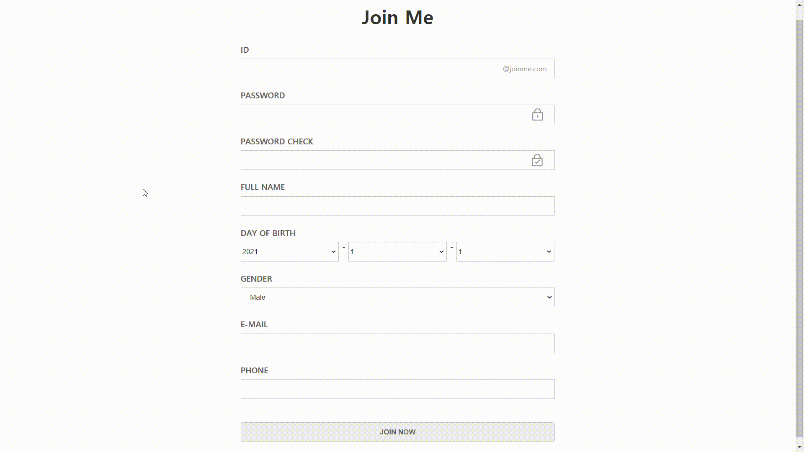

# Joining Form Using Regexp 

*sample image*

Generated by

- HTML5
- CSS3
- Vanilla JS

------
Noticable functions

- to appear warning text if the values of input tags don't match a valid id or password using Regexp.
- to change password-locker image as changing the value of password and password-check input tags
- to appear warning text when the value of password-check doesn't match
- to fit the last date of month by changing the value of month selection